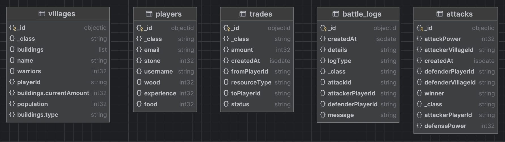

# Dokumentacja projektu gry typu plemiona

Projekt realizowany w ramach przedmiotu Bazy danych.

---

**Imiona i nazwiska autorów:**

Krystian Bulanda  
Dominik Kozimor

---

# Dokumentacja Techniczna - Prosta Gra Osadnicza

## Spis treści

1. [Wprowadzenie](#wprowadzenie)
2. [Technologie](#technologie)
3. [Architektura systemu](#architektura-systemu)
4. [Baza danych](#baza-danych)
5. [API REST](#api-rest)
6. [Zalety użytych technologii](#zalety-użytych-technologii)
7. [Konfiguracja i uruchomienie](#konfiguracja-i-uruchomienie)
8. [Możliwości rozwoju](#możliwości-rozwoju)

## Wprowadzenie

Niniejszy dokument stanowi dokumentację techniczną projektu "Prosta Gra Osadnicza" - aplikacji opartej o platformę Java Spring Boot. Jest to gra strategiczna, w której gracze mogą zarządzać wioskami, gromadzić zasoby, budować budynki, rekrutować wojowników oraz handlować z innymi graczami i przeprowadzać ataki.

Główne funkcjonalności systemu:

-   Zarządzanie graczami i ich zasobami
-   Zarządzanie wioskami i ich populacją
-   System rekrutacji wojowników
-   System konstrukcji budynków
-   System handlu zasobami między graczami
-   System ataków między graczami
-   Rejestracja zdarzeń w systemie (logi)

## Technologie

Projekt został zbudowany z wykorzystaniem następujących technologii:

-   **Java** - główny język programowania
-   **Spring Boot** - framework do tworzenia aplikacji w Javie
-   **Spring Data MongoDB** - integracja z bazą danych MongoDB
-   **Spring Web (REST API)** - tworzenie API RESTful
-   **MongoDB** - nierelacyjna baza danych dokumentowa
-   **Maven** - narzędzie do zarządzania zależnościami i budowania projektu

## Architektura systemu

Aplikacja została zaprojektowana zgodnie z wzorcem architektonicznym MVC (Model-View-Controller).

Główne warstwy aplikacji:

1. **Kontrolery (Controllers)** - odpowiadają za obsługę żądań HTTP, walidację danych wejściowych i przekazywanie ich do warstwy serwisów
2. **Serwisy (Services)** - zawierają logikę biznesową aplikacji
3. **Repozytoria (Repositories)** - odpowiadają za dostęp do danych w bazie MongoDB
4. **Model (Model)** - klasy reprezentujące encje (dokumenty) w bazie danych

### Komponenty projektu

#### Klasy modelu (7)

-   `Attack` - reprezentuje atak jednego gracza na drugiego
-   `Building` - reprezentuje budynek w wiosce
-   `BuildingType` - enum reprezentujący typy budynków
-   `EventLog` - reprezentuje log zdarzeń w systemie
-   `Player` - reprezentuje gracza
-   `Trade` - reprezentuje transakcję handlową między graczami
-   `Village` - reprezentuje wioskę gracza

#### Repozytoria (5)

-   `AttackRepository` - dostęp do danych ataków
-   `EventLogRepository` - dostęp do danych logów zdarzeń
-   `PlayerRepository` - dostęp do danych graczy
-   `TradeRepository` - dostęp do danych transakcji handlowych
-   `VillageRepository` - dostęp do danych wiosek

#### Serwisy (5)

-   `AttackService` - logika biznesowa związana z atakami
-   `EventLogService` - logika biznesowa związana z logami zdarzeń
-   `PlayerService` - logika biznesowa związana z graczami
-   `TradeService` - logika biznesowa związana z transakcjami handlowymi
-   `VillageService` - logika biznesowa związana z wioskami

#### Kontrolery (5)

-   `AttackController` - endpointy API związane z atakami
-   `EventLogController` - endpointy API związane z logami zdarzeń
-   `PlayerController` - endpointy API związane z graczami
-   `TradeController` - endpointy API związane z transakcjami handlowymi
-   `VillageController` - endpointy API związane z wioskami

#### Config (2)

-   `StringToBuildingTypeConverter` - implementuje logikę konwersji
-   `WebConfig` - rejestruje niestandardowy konwerter

## Baza danych

Projekt wykorzystuje MongoDB - nierelacyjną bazę danych dokumentową. Dokumenty są grupowane w kolekcje, które odpowiadają klasom modelu.

### Schemat bazy danych



#### Kolekcje

##### Kolekcja: players

Model Java: Player  
Opis: Kolekcja przechowująca dane graczy  
Struktura kolekcji:  
| Nazwa pola | Typ danych | Opis |
|:-------------|:-------------|:---------------------|
| id | String | Identyfikator gracza |
| username | String | Nazwa użytkownika |
| email | String | Adres email gracza |
| wood | Integer | Ilość drewna |
| stone | Integer | Ilość kamienia |
| food | Integer | Ilość żywności |
| experience | Integer | Punkty doświadczenia |

Przykładowy dokument:

```json
{
    "id": "60a1e2c3d4e5f6a7b8c9d0e1",
    "username": "jan_kowalski",
    "email": "jan@example.com",
    "wood": 100,
    "stone": 100,
    "food": 100,
    "experience": 100
}
```

##### Kolekcja: villages

Model Java: Village  
Opis: Kolekcja przechowująca dane wiosek  
Struktura kolekcji:  
| Nazwa pola | Typ danych | Opis |
|:-------------|:---------------|:---------------------------------------------|
| id | String | Identyfikator wioski |
| name | String | Nazwa wioski |
| playerId | String | ID właściciela wioski (referencja do Player) |
| population | Integer | Populacja wioski |
| warriors | Integer | Liczba wojowników |
| buildings | List<Building> | Lista budynków w wiosce |

Przykładowy dokument:

```json
{
    "id": "60a1e2c3d4e5f6a7b8c9d0e1",
    "name": "Kowalowo",
    "playerId": "60a1e2c3d4e5f6a7b8c9d0e2",
    "population": 100,
    "warriors": 50,
    "buildings": [
        {
            "id": "60a1e2c3d4e5f6a7b8c9d0e3",
            "type": "TOWN_HALL",
            "currentAmount": "1"
        },
        {
            "id": "60a1e2c3d4e5f6a7b8c9d0e4",
            "type": "BARRACKS",
            "currentAmount": "2"
        }
    ]
}
```

##### Kolekcja: attacks

Model Java: Attack  
Opis: Kolekcja przechowująca dane ataków  
Struktura kolekcji:  
| Nazwa pola | Typ danych | Opis |
|:------------------|:--------------|:-------------------------------------------------|
| id | String | Identyfikator ataku |
| attackerPlayerId | String | ID atakującego gracza (referencja do Player) |
| defenderPlayerId | String | ID broniącego się gracza (referencja do Player) |
| attackerVillageId | String | ID wioski atakującego (referencja do Village) |
| defenderVillageId | String | ID wioski broniącego się (referencja do Village) |
| attackPower | Integer | Siła ataku |
| defensePower | Integer | Siła obrony |
| winner | String | Zwycięzca (ATTACKER, DEFENDER) |
| createdAt | LocalDateTime | Data i czas ataku |

Przykładowy dokument:

```json
{
    "id": "60a1e2c3d4e5f6a7b8c9d0e1",
    "attackerPlayerId": "60a1e2c3d4e5f6a7b8c9d0e2",
    "defenderPlayerId": "60a1e2c3d4e5f6a7b8c9d0e3",
    "attackerVillageId": "60a1e2c3d4e5f6a7b8c9d0e4",
    "defenderVillageId": "60a1e2c3d4e5f6a7b8c9d0e5",
    "attackPower": 100,
    "defensePower": 75,
    "winner": "ATTACKER",
    "createdAt": "2023-06-11T10:15:30.000Z"
}
```

##### Kolekcja: buildings

Model Java: Building  
Opis: Kolekcja przechowująca dane budynków  
Struktura kolekcji:  
| Nazwa pola | Typ danych | Opis |
|:--------------|:--------------------|:----------------------|
| id | String | Identyfikator budynku |
| type | BuildingType (enum) | Typ budynku |
| currentAmount | String | Aktualny poziom/ilość |

Przykładowy dokument:

```json
{
    "id": "60a1e2c3d4e5f6a7b8c9d0e1",
    "type": "TOWN_HALL",
    "currentAmount": "3"
}
```

##### Kolekcja: battle_logs

Model Java: EventLog  
Opis: Kolekcja przechowująca logi zdarzeń  
Struktura kolekcji:  
| Nazwa pola | Typ danych | Opis |
|:-----------------|:--------------|:------------------------------------------------|
| id | String | Identyfikator logu |
| attackId | String | ID ataku (referencja do Attack) |
| attackerPlayerId | String | ID atakującego gracza (referencja do Player) |
| defenderPlayerId | String | ID broniącego się gracza (referencja do Player) |
| logType | String | Typ logu (ATTACK, TRADE) |
| message | String | Wiadomość logu |
| details | String | Szczegóły zdarzenia |
| createdAt | LocalDateTime | Data i czas zdarzenia |

Przykładowy dokument:

```json
{
    "id": "60a1e2c3d4e5f6a7b8c9d0e1",
    "attackId": "60a1e2c3d4e5f6a7b8c9d0e2",
    "attackerPlayerId": "60a1e2c3d4e5f6a7b8c9d0e3",
    "defenderPlayerId": "60a1e2c3d4e5f6a7b8c9d0e4",
    "logType": "ATTACK",
    "message": "Atak gracza 60a1e2c3d4e5f6a7b8c9d0e3 na gracza 60a1e2c3d4e5f6a7b8c9d0e4. Zwycięzca: ATTACKER",
    "details": "Siła ataku: 100, Siła obrony: 75, Zrabowane: drewno=30, kamień=20, jedzenie=15",
    "createdAt": "2023-06-11T10:15:30.000Z"
}
```

##### Kolekcja: trades

Model Java: Trade  
Opis: Kolekcja przechowująca dane transakcji handlowych  
Struktura kolekcji:  
| Nazwa pola | Typ danych | Opis |
|:-------------|:--------------|:------------------------------------------------------|
| id | String | Identyfikator handlu |
| fromPlayerId | String | ID gracza wysyłającego ofertę (referencja do Player) |
| toPlayerId | String | ID gracza otrzymującego ofertę (referencja do Player) |
| resourceType | String | Typ zasobu (wood, stone, food) |
| amount | Integer | Ilość zasobu |
| status | String | Status handlu (PENDING, COMPLETED, CANCELLED) |
| createdAt | LocalDateTime | Data i czas utworzenia oferty |

Przykładowy dokument:

```json
{
    "id": "60a1e2c3d4e5f6a7b8c9d0e1",
    "fromPlayerId": "60a1e2c3d4e5f6a7b8c9d0e2",
    "toPlayerId": "60a1e2c3d4e5f6a7b8c9d0e3",
    "resourceType": "wood",
    "amount": 50,
    "status": "PENDING",
    "createdAt": "2023-06-11T10:15:30.000Z"
}
```

### Relacje między kolekcjami

W MongoDB relacje między dokumentami są realizowane poprzez referencje (identyfikatory). Główne relacje w systemie:

-   Gracz (Player) ma wiele wiosek (Village) - relacja jeden-do-wielu
-   Wioska (Village) ma wiele budynków (Building) - relacja jeden-do-wielu
-   Gracz (Player) może inicjować wiele ataków (Attack) - relacja jeden-do-wielu
-   Gracz (Player) może inicjować wiele transakcji handlowych (Trade) - relacja jeden-do-wielu
-   Atak (Attack) generuje logi zdarzeń (EventLog) - relacja jeden-do-wielu
-   Transakcja handlowa (Trade) generuje logi zdarzeń (EventLog) - relacja jeden-do-wielu

## API REST

Aplikacja udostępnia API RESTful, które umożliwia klientom interakcję z systemem. Poniżej przedstawiono główne endpointy API:

### Gracze (`/api/players`)

| Metoda | Endpoint                           | Opis                                        |
| ------ | ---------------------------------- | ------------------------------------------- |
| GET    | `/api/players`                     | Pobierz wszystkich graczy                   |
| GET    | `/api/players/{id}`                | Pobierz gracza o podanym ID                 |
| GET    | `/api/players/username/{username}` | Pobierz gracza o podanej nazwie użytkownika |
| POST   | `/api/players`                     | Utwórz nowego gracza                        |
| PUT    | `/api/players/{id}/experience`     | Aktualizuj doświadczenie gracza             |
| PUT    | `/api/players/{id}/resources`      | Aktualizuj zasoby gracza                    |

### Wioski (`/api/villages`)

| Metoda | Endpoint                          | Opis                        |
| ------ | --------------------------------- | --------------------------- |
| GET    | `/api/villages`                   | Pobierz wszystkie wioski    |
| GET    | `/api/villages/{id}`              | Pobierz wioskę o podanym ID |
| GET    | `/api/villages/player/{playerId}` | Pobierz wioski gracza       |
| POST   | `/api/villages`                   | Utwórz nową wioskę          |
| PUT    | `/api/villages/{id}/population`   | Zwiększ populację wioski    |
| PUT    | `/api/villages/{id}/warriors`     | Rekrutuj wojowników         |
| PUT    | `/api/villages/{id}/buildings`    | Buduj budynek               |

### Ataki (`/api/attacks`)

| Metoda | Endpoint                           | Opis                      |
| ------ | ---------------------------------- | ------------------------- |
| GET    | `/api/attacks`                     | Pobierz wszystkie ataki   |
| GET    | `/api/attacks/{id}`                | Pobierz atak o podanym ID |
| GET    | `/api/attacks//player{playerId}`   | Pobierz ataki gracza      |
| GET    | `/api/attacks/village/{villageId}` | Pobierz ataki wioski      |
| POST   | `/api/attacks`                     | Przeprowadź atak          |

### Handel (`/api/trades`)

| Metoda | Endpoint                        | Opis                                  |
| ------ | ------------------------------- | ------------------------------------- |
| GET    | `/api/trades`                   | Pobierz wszystkie transakcje handlowe |
| GET    | `/api/trades/player/{playerId}` | Pobierz transakcje handlowe gracza    |
| POST   | `/api/trades`                   | Utwórz nową ofertę handlową           |
| PUT    | `/api/trades/{id}/accept`       | Zaakceptuj ofertę handlową            |
| PUT    | `/api/trades/{id}/reject`       | Odrzuć ofertę handlową                |

### Logi zdarzeń (`/api/logs`)

| Metoda | Endpoint                      | Opis                                    |
| ------ | ----------------------------- | --------------------------------------- |
| GET    | `/api/logs`                   | Pobierz wszystkie logi zdarzeń          |
| GET    | `/api/logs/type/{logType}`    | Pobierz logi zdarzeń o podanym typie    |
| GET    | `/api/logs/attack/{playerId}` | Pobierz logi zdarzeń związane z graczem |
| GET    | `/api/logs/attack/{attackId}` | Pobierz logi zdarzeń związane z atakiem |

### Tworzenie nowego gracza

**Żądanie:**

```bash
curl -X POST "http://localhost:8080/api/players?username=jan_kowalski&email=jan@example.com"
```

**Odpowiedź:**

```json
{
    "id": "60a1e2c3d4e5f6a7b8c9d0e1",
    "username": "jan_kowalski",
    "email": "jan@example.com",
    "wood": 100,
    "stone": 100,
    "food": 100,
    "experience": 0
}
```

### Pobieranie wszystkich graczy

**Żądanie:**

```bash
curl -X GET "http://localhost:8080/api/players"
```

**Odpowiedź:**

```json
[
    {
        "id": "60a1e2c3d4e5f6a7b8c9d0e1",
        "username": "jan_kowalski",
        "email": "jan@example.com",
        "wood": 100,
        "stone": 100,
        "food": 100,
        "experience": 0
    },
    {
        "id": "60a1e2c3d4e5f6a7b8c9d0e2",
        "username": "anna_nowak",
        "email": "anna@example.com",
        "wood": 100,
        "stone": 100,
        "food": 100,
        "experience": 0
    }
]
```

### Pobieranie gracza po ID

**Żądanie:**

```bash
curl -X GET "http://localhost:8080/api/players/60a1e2c3d4e5f6a7b8c9d0e1"
```

**Odpowiedź:**

```json
{
    "id": "60a1e2c3d4e5f6a7b8c9d0e1",
    "username": "jan_kowalski",
    "email": "jan@example.com",
    "wood": 100,
    "stone": 100,
    "food": 100,
    "experience": 0
}
```

### Aktualizacja zasobów gracza

**Żądanie:**

```bash
curl -X PUT "http://localhost:8080/api/players/60a1e2c3d4e5f6a7b8c9d0e1/resources?wood=50&stone=25&food=10"
```

**Odpowiedź:**

```json
{
    "id": "60a1e2c3d4e5f6a7b8c9d0e1",
    "username": "jan_kowalski",
    "email": "jan@example.com",
    "wood": 150,
    "stone": 125,
    "food": 110,
    "experience": 0
}
```

## Zarządzanie wioskami

### Tworzenie nowej wioski

**Żądanie:**

```bash
curl -X POST "http://localhost:8080/api/villages?name=Kowalowo&playerId=60a1e2c3d4e5f6a7b8c9d0e1"
```

**Odpowiedź:**

```json
{
    "id": "60a1e2c3d4e5f6a7b8c9d1e1",
    "name": "Kowalowo",
    "playerId": "60a1e2c3d4e5f6a7b8c9d0e1",
    "population": 0,
    "warriors": 0,
    "buildings": []
}
```

### Pobieranie wszystkich wiosek gracza

**Żądanie:**

```bash
curl -X GET "http://localhost:8080/api/villages/player/60a1e2c3d4e5f6a7b8c9d0e1"
```

**Odpowiedź:**

```json
[
    {
        "id": "60a1e2c3d4e5f6a7b8c9d1e1",
        "name": "Kowalowo",
        "playerId": "60a1e2c3d4e5f6a7b8c9d0e1",
        "population": 0,
        "warriors": 0,
        "buildings": []
    }
]
```

### Zwiększanie populacji wioski

**Żądanie:**

```bash
curl -X PUT "http://localhost:8080/api/villages/60a1e2c3d4e5f6a7b8c9d1e1/population?amount=10"
```

**Odpowiedź:**

```json
{
    "id": "60a1e2c3d4e5f6a7b8c9d1e1",
    "name": "Kowalowo",
    "playerId": "60a1e2c3d4e5f6a7b8c9d0e1",
    "population": 10,
    "warriors": 0,
    "buildings": []
}
```

### Rekrutacja wojowników

**Żądanie:**

```bash
curl -X PUT "http://localhost:8080/api/villages/60a1e2c3d4e5f6a7b8c9d1e1/warriors?amount=5"
```

**Odpowiedź:**

```json
{
    "id": "60a1e2c3d4e5f6a7b8c9d1e1",
    "name": "Kowalowo",
    "playerId": "60a1e2c3d4e5f6a7b8c9d0e1",
    "population": 5,
    "warriors": 5,
    "buildings": []
}
```

## System handlu

### Tworzenie oferty handlowej

**Żądanie:**

```bash
curl -X POST "http://localhost:8080/api/trades?fromPlayerId=60a1e2c3d4e5f6a7b8c9d0e1&toPlayerId=60a1e2c3d4e5f6a7b8c9d0e2&resourceType=wood&amount=30"
```

**Odpowiedź:**

```json
{
    "id": "60a1e2c3d4e5f6a7b8c9d2e1",
    "fromPlayerId": "60a1e2c3d4e5f6a7b8c9d0e1",
    "toPlayerId": "60a1e2c3d4e5f6a7b8c9d0e2",
    "resourceType": "wood",
    "amount": 30,
    "status": "PENDING",
    "createdAt": "2023-06-11T15:30:45.123Z"
}
```

### Akceptacja oferty handlowej

**Żądanie:**

```bash
curl -X PUT "http://localhost:8080/api/trades/60a1e2c3d4e5f6a7b8c9d2e1/accept"
```

**Odpowiedź:**

```json
{
    "id": "60a1e2c3d4e5f6a7b8c9d2e1",
    "fromPlayerId": "60a1e2c3d4e5f6a7b8c9d0e1",
    "toPlayerId": "60a1e2c3d4e5f6a7b8c9d0e2",
    "resourceType": "wood",
    "amount": 30,
    "status": "COMPLETED",
    "createdAt": "2023-06-11T15:30:45.123Z"
}
```

## System ataków

### Przeprowadzanie ataku

**Żądanie:**

```bash
curl -X POST "http://localhost:8080/api/attacks?attackerPlayerId=60a1e2c3d4e5f6a7b8c9d0e1&defenderPlayerId=60a1e2c3d4e5f6a7b8c9d0e2&attackerVillageId=60a1e2c3d4e5f6a7b8c9d1e1&defenderVillageId=60a1e2c3d4e5f6a7b8c9d1e2&attackPower=50"
```

**Odpowiedź:**

```json
{
    "id": "60a1e2c3d4e5f6a7b8c9d3e1",
    "attackerPlayerId": "60a1e2c3d4e5f6a7b8c9d0e1",
    "defenderPlayerId": "60a1e2c3d4e5f6a7b8c9d0e2",
    "attackerVillageId": "60a1e2c3d4e5f6a7b8c9d1e1",
    "defenderVillageId": "60a1e2c3d4e5f6a7b8c9d1e2",
    "attackPower": 50,
    "defensePower": 30,
    "winner": "ATTACKER",
    "createdAt": "2023-06-11T16:45:12.987Z"
}
```

## Logi zdarzeń

### Pobieranie wszystkich logów

**Żądanie:**

```bash
curl -X GET "http://localhost:8080/api/logs"
```

**Odpowiedź:**

```json
[
    {
        "id": "60a1e2c3d4e5f6a7b8c9d4e1",
        "attackId": "60a1e2c3d4e5f6a7b8c9d3e1",
        "attackerPlayerId": "60a1e2c3d4e5f6a7b8c9d0e1",
        "defenderPlayerId": "60a1e2c3d4e5f6a7b8c9d0e2",
        "logType": "ATTACK",
        "message": "Atak gracza 60a1e2c3d4e5f6a7b8c9d0e1 na gracza 60a1e2c3d4e5f6a7b8c9d0e2. Zwycięzca: ATTACKER",
        "details": "Siła ataku: 50, Siła obrony: 30, Zrabowane: drewno=25, kamień=15, jedzenie=10",
        "createdAt": "2023-06-11T16:45:12.990Z"
    },
    {
        "id": "60a1e2c3d4e5f6a7b8c9d4e2",
        "logType": "TRADE",
        "message": "Transakcja zakończona między graczami 60a1e2c3d4e5f6a7b8c9d0e1 i 60a1e2c3d4e5f6a7b8c9d0e2",
        "details": "Typ surowca: wood, ilość: 30, status: COMPLETED",
        "createdAt": "2023-06-11T15:30:45.130Z"
    }
]
```

### Pobieranie logów według typu

**Żądanie:**

```bash
curl -X GET "http://localhost:8080/api/logs/type/ATTACK"
```

**Odpowiedź:**

```json
[
    {
        "id": "60a1e2c3d4e5f6a7b8c9d4e1",
        "attackId": "60a1e2c3d4e5f6a7b8c9d3e1",
        "attackerPlayerId": "60a1e2c3d4e5f6a7b8c9d0e1",
        "defenderPlayerId": "60a1e2c3d4e5f6a7b8c9d0e2",
        "logType": "ATTACK",
        "message": "Atak gracza 60a1e2c3d4e5f6a7b8c9d0e1 na gracza 60a1e2c3d4e5f6a7b8c9d0e2. Zwycięzca: ATTACKER",
        "details": "Siła ataku: 50, Siła obrony: 30, Zrabowane: drewno=25, kamień=15, jedzenie=10",
        "createdAt": "2023-06-11T16:45:12.990Z"
    }
]
```
